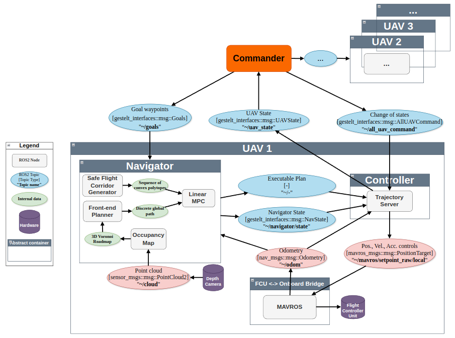

# Gestelt2
A Receding Horizon Planning (RHP) framework with a focus on multi-UAV navigation in cluttered environments. 

# Architecture 

The architecture below illustrates the high-level architecture of Gestelt using MAVROS as a communication bridge between the flight controller unit and the onboard computer.


# Installation and Setup for Simulation

Dependencies:
- System
    - Ubuntu 22.04 (Jammy)
    - ROS2 Humble
- Communications
    - eProsima/Micro-XRCE-DDS-Agent: Tag `v2.4.3`
    - PX4-msgs: Commit `bcb3d020bd2f2a994b0633a6fccf8ae47190d867`
- Simulation 
    - PX4-Autopilot: Commit `3d36c8519de83afd7b4617c3496d0304fb17cc28`
- Solvers
    - [OSQP](https://osqp.org/docs/index.html)
    - [OSQP-Eigen](https://github.com/robotology/osqp-eigen)

1. Clone dependencies 
```bash
cd ~/gestelt_ws/src/gestelt2
vcs import < simulation.repos --recursive --debug
vcs import < thirdparty.repos --recursive --debug
```
2. Install ROS2 and associated dependencies
```bash
# Install the Desktop version of ROS2 at https://docs.ros.org/en/humble/Installation.html 

# Install Package dependencies
sudo apt-get update && sudo apt-get install --no-install-recommends -y \
    vim \
    curl \
    wget \
    tmux \
    build-essential \
    software-properties-common \
    python3-pip \
    python3-vcstool \
    nlohmann-json3-dev \
    libasio-dev \
    libeigen3-dev \
    ros-$ROS_DISTRO-navigation2 \
    ros-$ROS_DISTRO-nav-2d-utils \
    ros-$ROS_DISTRO-message-filters \
    ros-$ROS_DISTRO-ros-gz-bridge

sudo apt-get install -y ros-$ROS_DISTRO-geometry*
sudo apt-get install -y ros-$ROS_DISTRO-tf2*
sudo apt-get install -y ros-$ROS_DISTRO-pcl*

```

3. Building the workspace
```bash
# Assuming your workspace is named as follows
cd ~/gestelt_ws/ && colcon build --symlink-install
cd ~/gestelt_ws/ && colcon build --symlink-install --packages-up-to gestelt_bringup
```

5. (OPTIONAL FOR PX4 SITL Simulation) Build PX4-autopilot 
```bash
git clone https://github.com/PX4/PX4-Autopilot.git --recursive 
git checkout 3d36c8519de83afd7b4617c3496d0304fb17cc28 
cd ~/gestelt_ws/PX4-Autopilot/
# Clean just in case
make distclean
bash ./Tools/setup/ubuntu.sh 
# Make SITL target for simulation
DONT_RUN=1 make px4_sitl gz_x500
```

6. (OPTIONAL FOR Micro-XCRE DDS) Install dependencies for communication with FCU 

(a) XRCE DDS installation
```bash
git clone https://github.com/eProsima/Micro-XRCE-DDS-Agent.git --recursive -b v2.4.3
cd Micro-XRCE-DDS-Agent
mkdir build
cd build
cmake ..
make
sudo make install
sudo ldconfig /usr/local/lib/
```

(b) Check if px4_msg definitions match those in PX4 Firmware
```bash
./src/px4-ros2-interface-lib/scripts/check-message-compatibility.py -v ./src/px4_msgs/ ../PX4-Autopilot/
```

# Quick start

To enable repeatability of experiments. We make use of scenarios which are configurations of drone spawn locations and environments stored in [gestelt_mission/scenarios.json](gestelt_mission/scenarios.json). Refer to [gestelt_mission/README.md](gestelt_mission/README.md) for more information.

## With mock drones
To run a simulation without a dynamical model i.e. to test the path planning logic.
```bash

``` 

## With PX4-SITL 
To run a simulation with a dynamical model (with physics).
```bash
ros2 launch gestelt_bringup multi_drone_sim_launch.py 
```
