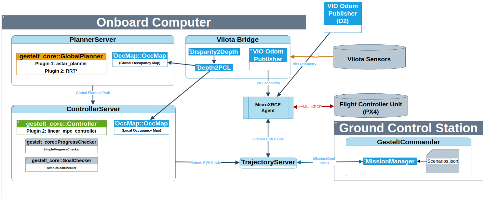

# Gestelt2
A Receding Horizon Planning (RHP) framework with a focus on multi-UAV navigation in cluttered environments. 

# Architecture 

The architecture below illustrates the high-level architecture of Gestelt. Communication between the flight controller unit and the onboard computer uses the MICROXRCE-DDS protocol, with sensors such as the Vilota VK180Pro and VK180 using the [eCAL protocol](https://github.com/eclipse-ecal/ecal).


The sections below go into more detail about each module and links are provided to their inner workings.

<!-- ## How does sending goals translate into plans and commands?
- Planner Server
    - Subscribes to 'goal' topic
    - Compute and publish global plan on 'plan' topic

- Controller Server
    - Subscribes to 'plan' topic
    - Compute commands and publish on 'intmd_cmd' topic

- Trajectory Server
    - Subscribes to 'intmd_cmd' topic
    - Performs ENU to NED conversion on `intmd_cmd` and correct for initial ground height
    - Sends 'trajectory_setpoint topic to PX4 Autopilot -->

## PlannerServer
Plugin-based server that generates a global plan.   

Currently implemented plugins include `astar_planner::AStarPlanner` of base class `gestelt_core::GlobalPlanner`. [Implementation found here](astar_planner)

[More Documentation](gestelt_planner/README.md)

## ControllerServer
Plugin-based server that generates a control input given a reference plan from the **PlannerServer** 

Currently implemented plugins include `linear_mpc_controller::LinearMPCController` of base class `gestelt_core::GlobalPlanner`. [Implementation found here](linear_mpc_controller)

[More Documentation](gestelt_controller/README.md)

## Trajectory Server
Interface between high level planning/control nodes and Flight Controller.
- Handles take off, landing, emergency stop, mission mode etc.
- Processes and filters command setpoints from ControllerServer

[More Documentation](trajectory_server/README.md)

## Vilota Bridge
This is a third party repo developed to bridge the eCAL topics from the Vilota sensors to ROS2 DDS. The eCAL topics being bridged includes the Visual Inertial Odometry (VIO) and the disparity map which is converted to a point cloud topic as input to the Occupancy map in the **PlannerServer** and **ControllerServer** module.

## OccMap (Occupancy Map)
A probabilistic mapper that uses [Bonxai](https://github.com/facontidavide/Bonxai) at it's core.

[More Documentation](occ_map/README.md)

## MissionManager

MissionManager is an abstraction that allows us to take-off, land and send goals to multiple drones via a Python API. One example can be found at [gestelt_commander/gestelt_commander/test_take_off_goal.py](gestelt_commander/gestelt_commander/test_take_off_goal.py) 

The `MissionManager` class is located at [gestelt_commander/gestelt_commander/mission_manager.py](gestelt_commander/gestelt_commander/mission_manager.py).

[More Documentation](gestelt_commander/README.md)

# Installation and Setup for Simulation

## 0. Dependencies:
- System
    - [Ubuntu 22.04 (Jammy)](https://releases.ubuntu.com/jammy/)
    - [ROS2 Humble](https://docs.ros.org/en/humble/Installation.html)
    - [QGroundControl](https://docs.qgroundcontrol.com/master/en/qgc-user-guide/getting_started/download_and_install.html)
- Communications
    - [eProsima/Micro-XRCE-DDS-Agent](https://github.com/eProsima/Micro-XRCE-DDS-Agent/releases/tag/v2.4.3): Tag `v2.4.3`
    - [PX4-msgs](https://github.com/PX4/px4_msgs/tree/bcb3d020bd2f2a994b0633a6fccf8ae47190d867): Commit `bcb3d020bd2f2a994b0633a6fccf8ae47190d867`
- Simulation 
    - [PX4-Autopilot](https://github.com/PX4/PX4-Autopilot/tree/3d36c8519de83afd7b4617c3496d0304fb17cc28): Commit `3d36c8519de83afd7b4617c3496d0304fb17cc28`
- Planning/Controls
    - [OSQP](https://github.com/osqp/osqp/tree/e8fe4de264d167a67b2e704a2c03807c97af2080) Commit `e8fe4de264d167a67b2e704a2c03807c97af2080`
    - [osqp-eigen](https://github.com/robotology/osqp-eigen/tree/e4cb498faad37f03579f81f10c941f334a2a282f) Commit `e4cb498faad37f03579f81f10c941f334a2a282f`

## 1. Install ROS2 and associated dependencies
```bash
# Install the Desktop version of ROS2 at https://docs.ros.org/en/humble/Installation.html 

# After installation, add the following commands to your .bashrc to enable colorized output and unbuffered output
export ROS_DISTRO="humble"
export RCUTILS_LOGGING_USE_STDOUT=1
export RCUTILS_LOGGING_BUFFERED_STREAM=0
export RCUTILS_COLORIZED_OUTPUT=1

# Install Package dependencies
sudo apt-get update && sudo apt-get install --no-install-recommends -y \
    vim curl wget tmux build-essential software-properties-common \
    python3-pip python3-vcstool \
    nlohmann-json3-dev \
    libasio-dev \
    libeigen3-dev \
    ros-$ROS_DISTRO-navigation2 \
    ros-$ROS_DISTRO-nav-2d-utils \
    ros-$ROS_DISTRO-message-filters 

sudo apt-get install -y ros-$ROS_DISTRO-geometry*
sudo apt-get install -y ros-$ROS_DISTRO-tf2*
sudo apt-get install -y ros-$ROS_DISTRO-pcl*
# Install ROS2 to Gazebo bridge
sudo apt-get install -y ros-$ROS_DISTRO-ros-gzharmonic*
```

## 2. Clone repos, including PX4-Autopilot repo and px4_msgs
```bash
mkdir -p ~/gestelt_ws/src/
git clone https://github.com/Temasek-Dynamics/gestelt2.git
cd ~/gestelt_ws/src/gestelt2
# Clone PX4-SITL Simulation
vcs import < simulation.repos --recursive --debug
# Clone px4_msgs library
vcs import < thirdparty.repos --recursive --debug

# Build OSQP and OSQP-Eigen libraries
mkdir -p ~/libraries/
cd ~/libraries
git clone https://github.com/osqp/osqp.git \
&& cd osqp \
&& git checkout e8fe4de264d167a67b2e704a2c03807c97af2080 \
&& mkdir build \
&& cd build \
&& sudo cmake -G "Unix Makefiles" .. \
&& sudo cmake --build . --target install

cd ~/libraries
git clone https://github.com/robotology/osqp-eigen.git \
&& cd osqp-eigen \
&& git checkout e4cb498faad37f03579f81f10c941f334a2a282f \
&& mkdir build \
&& cd build \
&& cmake ../ \
&& sudo make \
&& sudo make install 
```

## 3. Install dependencies for communication with FCU via MicroXCRE-DDS

(a) XRCE DDS installation
```bash
git clone https://github.com/eProsima/Micro-XRCE-DDS-Agent.git --recursive -b v2.4.3
cd Micro-XRCE-DDS-Agent
mkdir build
cd build
cmake ..
make
sudo make install
sudo ldconfig /usr/local/lib/
```

## 4. (OPTIONAL, build if doing PX4 SITL Simulation) Build PX4-autopilot 
```bash
# DO NOT CLONE THE PX4-AUTOPILOT REPO in the `src` folder of your colcon workspace. 
# The cloning step should be handled by the earlier installation instruction "vcs import < simulation.repos --recursive --debug"
git clone https://github.com/PX4/PX4-Autopilot.git --recursive 
cd ~/PX4-Autopilot
git checkout 3d36c8519de83afd7b4617c3496d0304fb17cc28 

# Install system dependencies 
bash ./Tools/setup/ubuntu.sh 
# Make SITL target for simulation
# NOTE: Enter 'u' to update all submodules when prompted
make px4_sitl
# IF you fail to build, run 'make distclean'
# Make x500 model, and check if it works successfully
make px4_sitl gz_x500
```

## 5. Build ROS2 workspace
```bash
# Assuming your workspace is named as follows
cd ~/gestelt_ws/ && colcon build --symlink-install
```

# Quick start
To ease repeatability of experiments. We make use of scenarios which are configurations of drone spawn locations and environments stored in [gestelt_mission/scenarios.json](gestelt_mission/scenarios.json). Refer to [gestelt_mission/README.md](gestelt_mission/README.md) for more information.

For more details on what each launch file does, refer to [gestelt_bringup/README.md](gestelt_bringup/README.md)

## With PX4-SITL 
To run a simulation with a dynamical model (with physics).
```bash
# Start QGroundControl, get it from https://docs.qgroundcontrol.com/master/en/qgc-user-guide/getting_started/download_and_install.html
# This is because the PX4 parameters are such that a ground control station is required for operation, but it can be disabled
# via a PX4 parameter.
/QGroundControl.AppImage

# Launch the simulation.
# To change the scenario, modify the `SCENARIO_NAME` in the launch file 
ros2 launch gestelt_bringup multi_drone_sim_launch.py 

# Command take-off and sending of goals
ros2 launch gestelt_bringup test_point_goal_sim.py

# Land the drone after it is done
ros2 run gestelt_commander land_sim
```

### Known Issues

- Drone cannot take off
    - Look at QGroundControl logs, are there missing sensors? If so, it could be a compatability with the ros_gz_bridge, of which there is no known solution, only a workaround.
    - The workaround is to launch gazebo using the PX4-SITL executable. In the simulation launch file [multi_drone_sim_launch.py](gestelt_bringup/launch/sim/multi_drone_sim_launch.py), make sure `PX4_GZ_STANDALONE=1` is commented out. Relaunch and check if the sensors can be detected in QGroundControl.

- Drone executes most of the path but is not able to move towards the goal when within 0.5m of it.
    - The suspicion is that the controller and planner algorithm is working as expected but the controller server might not have been calling the controller properly. 
    - The fact is that the commands that are output from the controller server looks to be in the correct magnitude and sign but the drone is not executing them.

## Actual drone
To test a single drone together with ground control computer (for visualization and mission commands), the following helper scripts are provided (TMUX required).

```bash
# Change directory to root of this repository

# On the drone
gestelt_integration/avetics/startup_scripts/gestelt_startup.sh

# On the ground control computer
gestelt_integration/avetics/startup_scripts/gcs_startup.sh
```