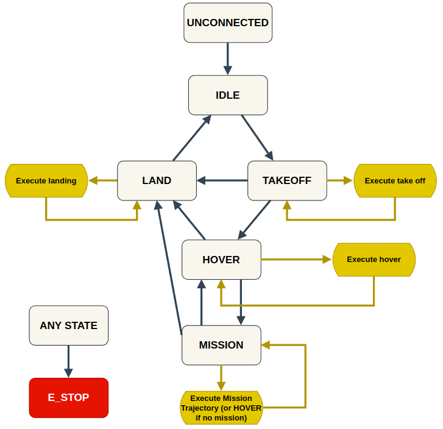

# Trajectory Server

# System design

Trajectory server is a state machine to control take-off, landing, and mission execution at a higher level than that afforded by the PX4 autopilot firmware.

There are 7 states: Unconnected, Idle, Landing, TakingOff, Hovering, Mission and EmergencyStop. The state transitions are defined in the figure below:


The state transitions can be triggered by either a service call or a topic.

# States 

**Unconnected**: No connection to the flight controller unit has been detected.

**Idle**: Connection to the flight controller unit has been established. The drone is unarmed and not in offboard mode.

**Landing**: The drone lands and disarms itself. 

**TakingOff**: The drone switches to offboard mode and arms itself, then takes off to a user-specified height. After the take-off height is achieved, the state transitions to **Hovering**

**Hovering**: The drone hovers in place at it's current position.

**Mission**: The server takes in an executable plan and execute it on the drone. 

**EmergencyStop**: (Unimplemented) All motor actuation is cut off. This is a last resort. If the drone is flying, it will fall to the ground immediately

# Debugging
```bash
colcon build --packages-select trajectory_server && ros2 launch trajectory_server traj_server_test.py

# Send service requests

# Take off 
ros2 run trajectory_server uav_cmd_srv_client 0 1.5 
# Landing 
ros2 run trajectory_server uav_cmd_srv_client 1
# Start Mission
ros2 run trajectory_server uav_cmd_srv_client 2 0
# Stop Mission
ros2 run trajectory_server uav_cmd_srv_client 3
# Emergency Stop
ros2 run trajectory_server uav_cmd_srv_client 4
```

# External libraries
1. [digint/tinyfsm](https://github.com/digint/tinyfsm): Header-only finite state machine library