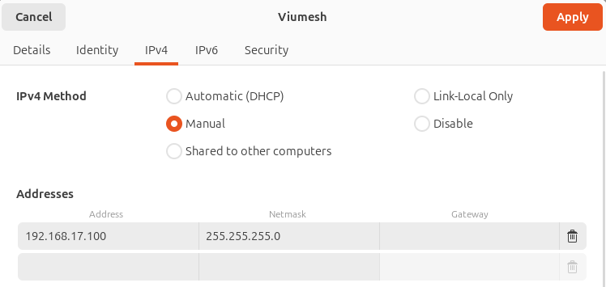
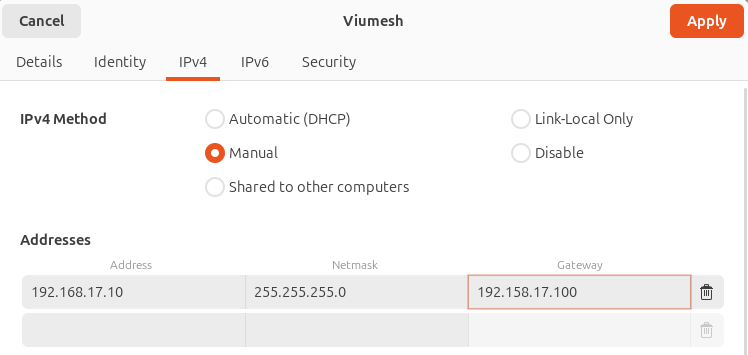

# Avetics Integration

## Installing dependencies
- Follow README.md at top directory

## Additional dependencies
```bash
# opencv library dependency version mismatch https://github.com/IntelRealSense/realsense-ros/issues/3203 
sudo apt install libopencv-dev=4.5.4+dfsg-9ubuntu4
# Library used by vilota bridge
sudo apt-get install capnproto ros-humble-tf-transformations

# Upgrade packages
pip install transforms3d==0.4.2 # fix for module 'numpy' has no attribute 'float', requires transforms3d >= 0.4.1
pip install pycapnp==1.3.0 # importing doesn't seem to work well for 2.0.0
pip3 install "numpy<2.0"
```

## Clone repos
```bash
# Vilota (ecal <-> ROS2 DDS) depth map bridge
https://bitbucket.org/nusuav/vilota_bridge/src/master/
# Depth map to PCD
https://bitbucket.org/nusuav/depth2pcl/src/master/
```

## Hardware
- Onboard computer: Nvidia Orin NX
- Flight Controller Unit:
- Network adaptor: Viumesh
- VIO: Vilota VK180Pro (forward facing) and VK180 (Backward facing)

## Authentication
User: nvidia, pass: nvidia

## Start up vilota VIO
```bash
ros2 run vision vio_bridge_px4
# 1 (VK180Pro)
# 1 (Forward Facing)
# 0 -10 0 (Roll, Pitch, Yaw)
```

To access Vilota camera settings via browser-based GUI:
- Vilota IP (VK180Pro): 10.42.0.64
- Vilota IP (VK180): 10.42.0.65

To debug on nuttx shell use `listener vehicle_visual_odometry`

### SSH into vilota computer
```bash
ssh compulab@10.42.0.64 
# password is compulab

# Configs are stored in
cd /opt/vilota/configs/vio 

```

## Zenoh
1. Using the standalone plugin from https://github.com/eclipse-zenoh/zenoh-plugin-ros2dds
```bash
echo "deb [trusted=yes] https://download.eclipse.org/zenoh/debian-repo/ /" | sudo tee -a /etc/apt/sources.list > /dev/null
sudo apt update
sudo apt install zenoh-bridge-dds

# On drone
zenoh-bridge-ros2dds -c /home/nvidia/gestelt_ws/src/gestelt2/gestelt_network/zenoh_d0_cfg.json5

# On host
zenoh-bridge-ros2dds -c /home/john/gestelt_ws/src/gestelt_network/zenoh_host_cfg.json5
```

## Networking

### Accesing router
User: admin, pass: admin

### Network manager settings

For GCS computer:



For Drone 0:
- We use host address as default gateway so we can access the internet



GCS: 192.168.17.100
GCS-Viumesh: 192.168.17.1

Drone0-Viumesh: 192.168.17.11
Drone0: 192.168.17.10

### [DOES NOT WORK] Set up a network bridge on the GCS computer
A network bridge would allow us to forward packets between network interfaces. In this case, we want to have internet access on the drones and therefore we would forward packets within the wireless interface (e.g. wlp5s0) on the GCS and the wired interface (e.g. enp2s0) connected to the GCS viumesh.

```bash
# Use ip link to get the name of the network interfaces you wish to connect
# In this example, we use the wired interface 'enp2s0' and the wireless interface 'wlp5s0'
ip link
# Create bridge named br0
sudo ip link add br0 type bridge
# Show bridge details
ip -d link show br0
# Show bridge details in a pretty JSON format (which is a good way to get bridge key-value pairs):
ip -j -p -d link show br0

# Enable 4addr on wireless interface
sudo iw dev wlp5s0 set 4addr on

# Add interfaces to the bridge
sudo ip link set enp2s0 master br0
sudo ip link set wlp5s0 master br0


# Bring down bridge
sudo ip link set br0 down
# Delete bridge
sudo ip link delete br0 type bridge
```

References:
1. https://developers.redhat.com/articles/2022/04/06/introduction-linux-bridging-commands-and-features#spanning_tree_protocol
2. https://serverfault.com/questions/152363/bridging-wlan0-to-eth0

### [DOES NOT WORK] Set up NAT on GCS for internet access on drones
```bash
# Use ip link to get the name of the network interfaces you wish to connect
# In this example, we use the wired interface 'enp2s0' and the wireless interface 'wlp5s0'
ip link

echo 1 > /proc/sys/net/ipv4/ip_forward

# Refer to https://linux.die.net/man/8/iptables for flag usage
iptables -t nat -A POSTROUTING -o wlp5s0 -j MASQUERADE

# Assign IP address to yourself:
ifconfig enp2s0 192.168.17.100 netmask 255.255.255.0 up

# Update /etc/dhcp/dhcpd.conf
vim /etc/dhcp/dhcpd.conf
subnet 192.168.17.100 netmask 255.255.255.0 {
    range 192.168.17.0 192.168.17.120;
    option routers 192.168.17.100;
    option domain-name-servers 127.0.0.53;
}

# Start dhcp server
sudo /etc/init.d/isc-dhcp-server start

# Check status of dhcp server
sudo systemctl status isc-dhcp-server

# Check Iptable rules
sudo iptables --table nat --list
```

References:
1. https://serverfault.com/questions/152363/bridging-wlan0-to-eth0
2. https://medium.com/@sydasif78/setting-up-a-dhcp-server-on-ubuntu-a-guide-for-network-engineer-d620c5d7afb2

## Known issues

1. Transmitter must be switched on before the FCU is switched on. Failing which, the transmitter is not able to change flight modes on the FCU.s

2. Drone must always be started facing WEST(y-axis/LEFT) of it's intended NORTH heading (x-axis/forward). This is because the default starting Vilota VIO heading is North, and the drone obeys ENU convention where East is forward. 