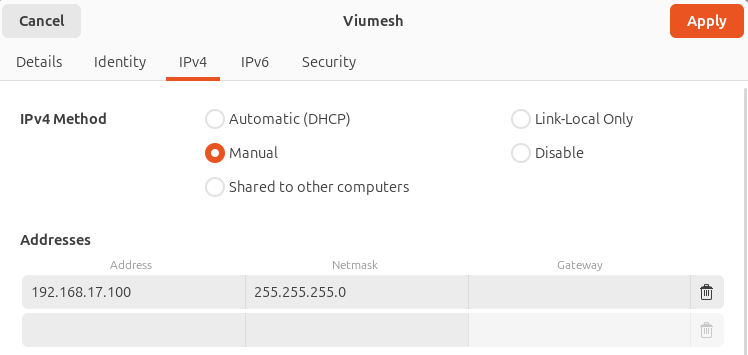
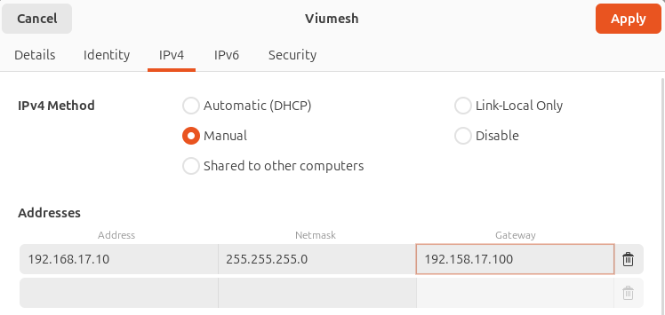

# Avetics Integration

# Hardware on Avetics drone
- Onboard computer: Nvidia Orin NX
- Flight Controller Unit:
- Network adaptor: Viumesh
- VIO: Vilota VK180Pro (forward facing) and VK180 (Backward facing)

# Authentication

On the drone
```bash
User: nvidia
pass: nvidia
```

# Installing dependencies
- Follow README.md at top directory

## Additional dependencies
These additional dependencies are for the vilota bridge
```bash
# opencv library dependency version mismatch https://github.com/IntelRealSense/realsense-ros/issues/3203 
sudo apt install libopencv-dev=4.5.4+dfsg-9ubuntu4
# Library used by vilota bridge
sudo apt-get install capnproto ros-humble-tf-transformations

# Upgrade packages
pip install transforms3d==0.4.2 # fix for module 'numpy' has no attribute 'float', requires transforms3d >= 0.4.1
pip install pycapnp==1.3.0 # importing doesn't seem to work well for 2.0.0
pip3 install "numpy<2.0"
```

## Clone repos for vilot bridge and depth_map_to_pcl conversion
```bash
# Vilota (ecal <-> ROS2 DDS) depth map bridge
https://bitbucket.org/nusuav/vilota_bridge/src/master/
# Depth map to PCD
https://bitbucket.org/nusuav/depth2pcl/src/master/
```


# Vilota VIO 

## Running the VIO bridge alone
```bash
ros2 run vision vio_bridge_px4
# 1 (VK180Pro)
# 1 (Forward Facing)
# 0 -10 0 (Roll, Pitch, Yaw)
```

## Access GUI

To access Vilota camera settings via browser-based GUI:
- Vilota IP (VK180Pro): 10.42.0.64
- Vilota IP (VK180): 10.42.0.65

## Viewing topics as received by PX4 FCU

1. Open QGroundControl > Analyze Tools > MavLINK Console

To debug on nuttx shell use `listener vehicle_visual_odometry`

## SSH into vilota computer
```bash
ssh compulab@10.42.0.64 
# password is compulab

# VIO Configs are stored in '/opt/vilota/configs/vio' 
# Camera driver configs are stored in '/opt/vilota/configs/camera_driver' and they can be used to change the reference camera link for the TF of the individual camera lenses, the section to change will look something like 
        "reference_cam": "camd",
        "body_T_cam0": {
            "px": -0.2,
            "py": 0.0,
            "pz": 0.0,
            "qx": -0.5,
            "qy": -0.5,
            "qz": 0.5,
            "qw": 0.5
        }
```

# Networking

## Accesing router
User: admin, pass: admin

## IP Addresses
```
GCS: 192.168.17.100
GCS-Viumesh: 192.168.17.1

Drone0-Viumesh: 192.168.17.11
Drone0: 192.168.17.10
```

## Network manager settings

For GCS computer:



For Drone 0:
- We use host address as default gateway so we can access the internet




# Uinsg Zenoh to namespace

## Setup

1. Install the standalone plugin from https://github.com/eclipse-zenoh/zenoh-plugin-ros2dds

```bash
echo "deb [trusted=yes] https://download.eclipse.org/zenoh/debian-repo/ /" | sudo tee -a /etc/apt/sources.list > /dev/null
sudo apt update
sudo apt install zenoh-bridge-ros2dds
```

2. Ensure that LOCALHOST_ONLY is enabled on all machines
```bash
# Add to ~/.bashrc
export ROS_AUTOMATIC_DISCOVERY_RANGE=LOCALHOST
```

3. Get IP Addresses of all machines
```bash
# Drone 0: 192.168.17.10
# GCS: 192.168.17.100
```

4. Configure Zenoh
```bash

```

## Running Zenoh
```bash
# On drone
zenoh-bridge-ros2dds -c /home/john/gestelt_ws/src/gestelt2/gestelt_integration/zenoh/zenoh_d0_cfg.json5
# On ground control station
zenoh-bridge-ros2dds -c /home/john/gestelt_ws/src/gestelt2/gestelt_integration/zenoh/zenoh_gcs_cfg.json5
```


# Micro-XRCE Client
In order for ROS2 <-> Micro-XRCE DDS communication to take place, there are 2 nodes required, the Micro-XRCE Client and the MicroXRCE Agent. More information can be found [here](https://github.com/eProsima/Micro-XRCE-DDS-Agent).

A Micro-XRCE Client is running as an application in the PX4 Flight Controller Unit and the script for starting the `uxrce_dds_client` is located in the FCU filesystem path at `/etc/init.d/rc.serial`. 


# Known issues

1. Transmitter must be switched on before the FCU is switched on. Failing which, the transmitter is not able to change flight modes on the FCU.s

2. Drone must always be started facing WEST(y-axis/LEFT) of it's intended NORTH heading (x-axis/forward). This is because the default starting Vilota VIO heading is North, and the drone obeys ENU convention where East is forward. 