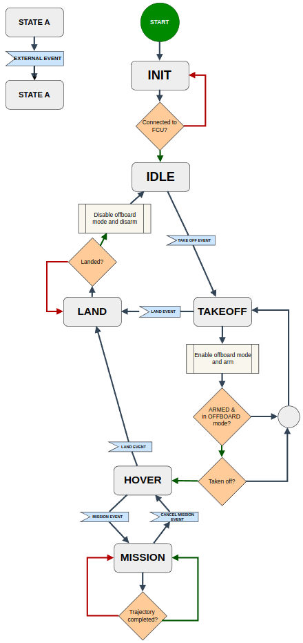
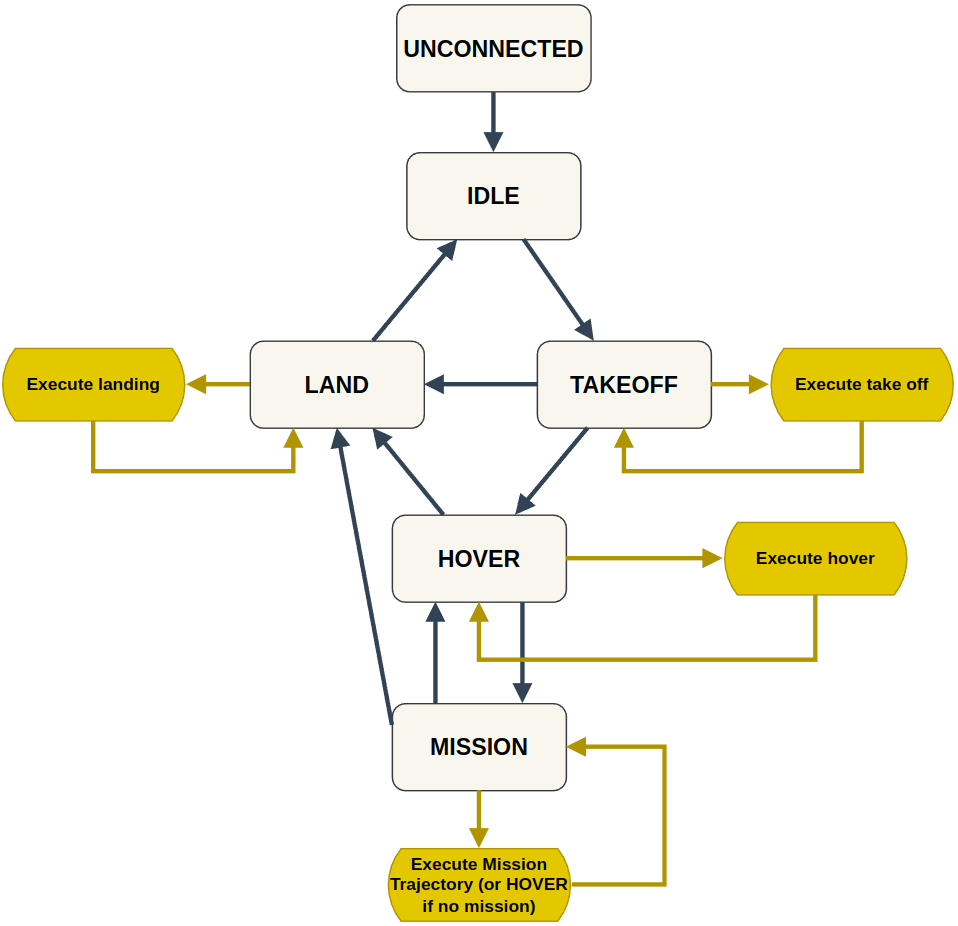

# Trajectory Server

# System design

Trajectory server is a state machine to control take-off, landing, and mission execution at a higher level than that afforded by the PX4 autopilot firmware. The rationale is to be able to autonomously manage the take-off, landing and planning/controls of the drone. It is also crucial for safety purposes, for instance if the drone is not in **Mission** mode then it will ignore all control inputs provided by the planner/controller modules.

Trajectory Server is a multi-threaded node running 2 main timer loops in parallel to handle the state transitions and publish control commands. This will be explained the the "Timer Loops" section.

##  States in State Machine

There are 7 states: **Unconnected**, **Idle**, **Landing**, **TakingOff**, **Hovering**, **Mission** and **EmergencyStop**. The state transitions can be triggered by either a service call or a topic. The state transitions are defined in the figure below:

- **Unconnected**: No connection to the flight controller unit has been detected.
- **Idle**: Connection to the flight controller unit has been established. The drone is unarmed and not in offboard mode.
- **Landing**: The drone lands and disarms itself. 
- **TakingOff**: The drone switches to offboard mode and arms itself, then takes off to a user-specified height. After the take-off height is achieved, the state transitions to **Hovering**
- **Hovering**: The drone hovers in place at it's current position.
- **Mission**: The server takes in an executable plan and execute it on the drone. 
- **EmergencyStop**: (**UNIMPLEMENTED**) All motor actuation is cut off. This is a last resort. If the drone is flying, it will cut all power supply to the motors and most likely crash.

## Timer Loops

There are 2 timer loops running in parallel, the "Execute Controls Loop" and the "State Transition Loop"

### Execute Controls Loop

The Execute trajectory loop ensures that the right set of control inputs are given to the drone corresponding to the state. For instance, when in **TakingOff** state, a set of commands to takeoff to a user-specified height is issued.

### State Trajectory Loop

The State Trajectory Loop loop handles the transition between different states. The transitions are triggered by "events" which can be sent via the `\global_uav_command` or `~\uav_command` topic. To ensure that certain conditions are met before transitioning the state, the state of the drone is continuously polled as in the diamond in each iteration of the loop. 

## Publishers:
- `~/tf` <>
    - Publishes transform between map and drone's base link frame
    - Used by PlannerServer and ControllerServer to get current pose of the drone
- `~/odom` <nav_msgs::msg::Odometry>
    - Used for visualization
    - Provides current position and velocity of agent
- `~/fmu/in/vehicle_command` <px4_msgs::msg::VehicleCommand>
    - Sent to PX4
    - Set vehicle mode 
- `~/fmu/in/offboard_control_mode` <px4_msgs::msg::OffboardControlMode>
    - Sent to PX4
    - Set offboard mode (trajectory, attitude, rates, thrust_torque, actuator)
- `~/fmu/in/trajectory_setpoint` <px4_msgs::msg::TrajectorySetpoint>
    - Sent to PX4
    - Publish trajectory setpoints: Position, Velocity, Acceleration, Jerk
- `~/fmu/in/actuator_motors` <px4_msgs::msg::ActuatorMotors>
    - Sent to PX4
    - Publish actuator commands directly
- `~/fmu/in/vehicle_torque_setpoint` <px4_msgs::msg::VehicleTorqueSetpoint>
    - Sent to PX4
    - Publish torque setpoints
- `~/fmu/in/vehicle_thrust_setpoint` <px4_msgs::msg::VehicleThrustSetpoint>
    - Sent to PX4
    - Publish thrust setpoints

## Subscribers:
- `~/fmu/out/vehicle_odometry` <nav_msgs::msg::VehicleOdometry>
    - Subscribe to vehicle odometry from FCU.
- `~/fmu/out/vehicle_status` <nav_msgs::msg::VehicleStatus>
    - Subscribe to vehicle status from FCU. Used to check vehicle mode (offboard, landing etc.) and arming state.
- `intmd_cmd` <px4_msgs::msg::TrajectorySetpoint>
    - Control input command sent by Controller Server. 
- `\global_uav_command` <gestelt_interfaces::msg::AllUAVCommand>
    - Global topic used to send state transition commands to all drones
    - Serves the same purpose as the `~\uav_command` topic
- `~\uav_command` <gestelt_interfaces::msg::AllUAVCommand>
    - Namespaced topic used to send state transition commands to all drones
    - Serves the same purpose as the `\global_uav_command` topic

# External libraries
1. [digint/tinyfsm](https://github.com/digint/tinyfsm): Header-only finite state machine library